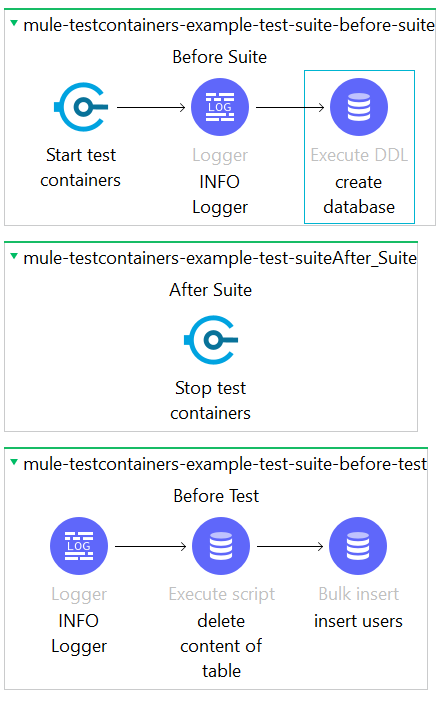

# Mule-Testcontainers-Db Extension

This extension allows to use database Testcontainer in your Munit tests for Mule4. This is possible by specifying a jdbc url and a driver class name.

An example configuration in you properties file could be like this if you want to test with PostgreSQL.

```
db.user=postgres
db.hostname=localhost
db.database=postgres
db.port=5432
db.driver.classname=org.testcontainers.jdbc.ContainerDatabaseDriver
db.url=jdbc:tc:postgresql:///postgresql
```

Add this dependency to your application pom.xml

```
<dependency>
    <groupId>io.github.obscure1910</groupId>
    <artifactId>mule-testcontainers-db</artifactId>
    <version>1.0.0</version>
    <scope>test</scope>
    <classifier>mule-plugin</classifier>
</dependency>
```

also add your database Testcontainers dependency

```
<dependency>
    <groupId>org.testcontainers</groupId>
    <artifactId>postgresql</artifactId>
    <scope>test</scope>
    <version>1.19.0</version>
</dependency>
```

and configure it as shared library
```
<build>
    ...
    <plugins>
        ...
        <plugin>
            <groupId>org.mule.tools.maven</groupId>
            <artifactId>mule-maven-plugin</artifactId>
            <version>${mule.maven.plugin.version}</version>
            <extensions>true</extensions>
            <configuration>
                <sharedLibraries>
                    ...
                    <sharedLibrary>
                        <groupId>org.testcontainers</groupId>
                        <artifactId>postgresql</artifactId>
                    </sharedLibrary>
                </sharedLibraries>
            </configuration>
        </plugin>
    </plugins>
</build>
```

In order to start and stop containers you have to configure the "Before Suite" and "After Suit" processors.
If you want to create database tables via scripts you can use the normal Mule DB processors.



A complete example (Anypoint Studio) how to use this extension is in the repository [mule-testcontainers-example](https://github.com/obscure1910/mule-testcontainers-example/tree/plugin).
The main branch of the referenced repository contains an example how to use Testcontainers without this plugin but with beans.